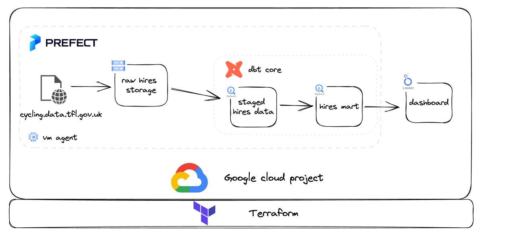
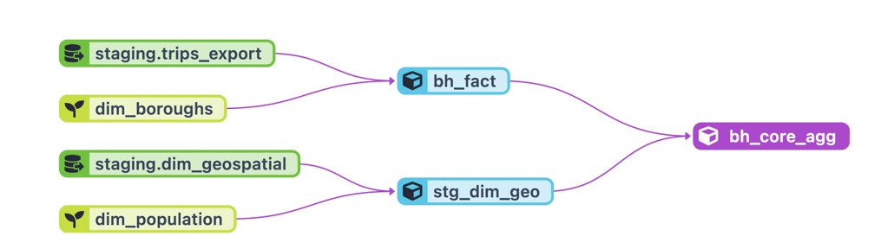
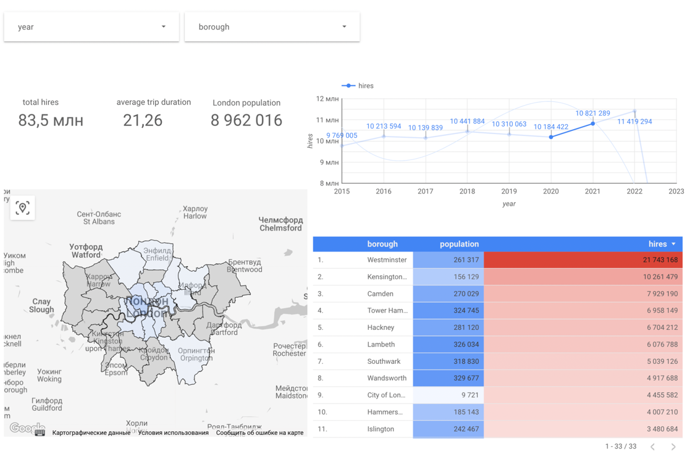

### Project overview

> _It is by riding a bicycle that you learn the contours of a country best, since you heave to sweat up the hills and
can coast down them._
>
> -- <cite>Ernest Hemingway</cite>

Life in a big city can be very challenging sometimes. There are traffic jams, lack of fresh air and a lot of stress
caused by plenty of vehicles around. One of the possible solution for that problem is a bicycle.
This project provides a pipeline to get and transform London bicycle hires data that can be used for ml models or for
visualisation to provide a clear picture of bicycle hires in London boroughs.

### Architecture overview

Data is downloaded from `cycling.data.tfl.gov.uk` and being stored in `raw hires storage` in gcs. Another workflow takes
data from the storage and uploads it to `hires staged data` bigquery dataset. After that dbt model is executed and final
result goes into `hires mart` dataset. All mentioned workflows are executed on prefect agent hosted on compute engine
vm.

* Prefect orchestrates main workflow including dbt model execution
* Workflows are executed on Prefect agent which is deployed with terraform (with startup script)
* Prefect Cloud is required to run workflows
* Workflows are written in python

### Pipelines overview

Project consists of 4 main flows:

* `get_urls` - this flow scrap a list of urls from `cycling.data.tfl.gov.uk` that will be used by `raw_to_gcs` further.
  It is not orchestrated by Prefect due to complexity of web scrapping of the page, there is a chrome driver that must
  be used in order to prepare a list of urls for download so this flow is supose to be run locally for url list
  preparation only, then the list can be pushed to repo and used by other flows

* `raw_to_gcs` - downloads files from `cycling.data.tfl.gov.uk` according to predefined list of urls, converts files to
  parquet and uploads them to gcs bucket

* `gcs_to_bq` - combines parquet files from gcs and loads into bq staged dataset

* `load_geospatial` - loads static geospatial data into bq

* `dbt` - executes dbt model

Pipelines must be execution in following order :

`get_urls` >> `raw_to_gcs`  >> `gcs_to_bq` >> `load_geospatial` >> `dbt`

### Data Model

source tables:

* `trips_export` - combined source trips data with unified schema
* `dim_boroughs` - mapping of bike stations to boroughs
* `dim_geospatila` - boroughs geospatial data (polygons and multipolygons of locations for visualisation)
* `dim_population` - borough population data with basic geospatial

intermediate data:

* `bh_facts` - hires data with joined boroughs dimension
* `stg_dim_geo` - boroughs geospatial data with population data

mart:

* `bh_core_agg` - aggregated trips data, has amount of trips, duration per year and borough

### Dashboard

Dashboard is prepared in Looker studio, see example on the screenshot.

main findings:

* Most amount of rents are happening in Central London (Westminster, Kensington)
* There is no hires data for some boroughs. There are multiples reasons for that, from lack of stations to data quality
  issues.
* There might be a data quality issue in mapping of stations to boroughs. Source does not have good quality data for
  that. It can be fixed by using data from one of the api providers in order to map addresses properly but it is not in
  a current scope of this project
* There is a significant increase in amount of hires after 2020.

### Deployment

Deployment steps are covered in [deployment.md](docs/deployment.md).

### Next steps

In the current implementation agent vm executes all the flows, so it takes time to process flat files from source into
buckets and then to bq (~300 files). This issue can be fixed by execting ingestion in parallel (e.g with cloud run
jobs). This project can also benefit from CI/CD pipeline implemented with GitHub actions.